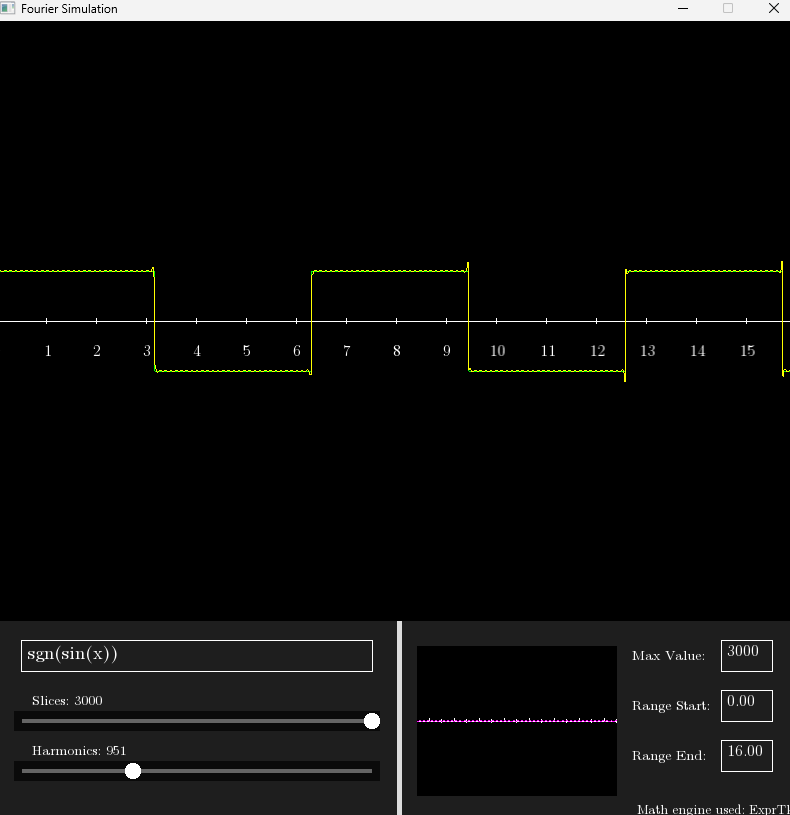
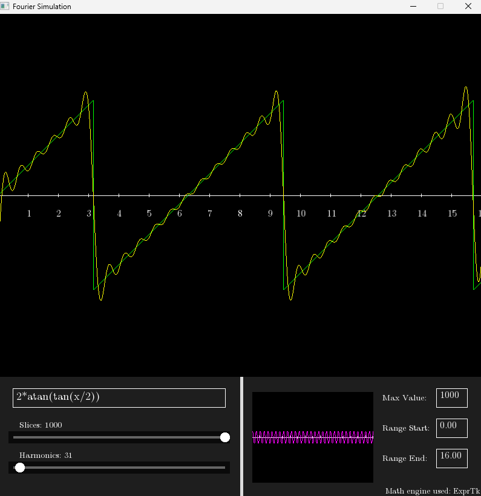

# 🌊 Fourier Series Visualizer

An interactive mathematical simulation built with C++17 and SFML 3.0. This tool allows users to visualize how complex periodic signals are constructed by summing simple sine waves (harmonics) using the Fourier Series.

---

## 📸 Gallery

| Square Wave Synthesis | Sawtooth Wave Construction |
| :---: | :---: |
|  |  |

<p align="center">
  <em>Interactive UI featuring real-time harmonic manipulation.</em>
</p>

---

## 🔬 Mathematical Fundamentals

### The "2x Slices" Rule: Precision vs. Harmonics

In this simulation, **Slices** refer to the horizontal resolution (the number of sampling points) used to draw the wave. For high-fidelity visualization, we apply the following logic:

**Rule:** `Slices ≥ 2 × Number of Harmonics`

**Why is this necessary?**

This requirement is proved in the **Nyquist-Shannon Sampling Theorem**. To accurately represent a signal of a specific frequency, it must be sampled at least twice as fast as its highest frequency component.

*   **Aliasing:** If you attempt to render 50 harmonics with only 40 slices, the high-frequency components will "alias," creating jagged and incorrect artifacts.
*   **Fidelity:** By ensuring the slice count is at least double the harmonic count, each peak and valley of the highest frequency harmonic is captured by at least one sampling point, resulting in a smooth and mathematically accurate curve.

---

## 🎨 Visual Interface: The Magenta Wave

The simulation provides a dual-view system to better understand the additive nature of the series:

* **Top View (Main Approximation):** Shows the result of summing all active harmonics. This is the "Fourier Series" itself.
* **Bottom View (The Magenta Wave):** This waveform represents the **latest individual harmonic added to the series**. 

---

## 📐 Maths

The engine utilizes the **ExprTk** library to parse and sum classic series as:

---

## 🛠️ Build and Installation

### Prerequisites
*   **Compiler:** GCC/G++ (C++17 support required).
*   **Library:** SFML 3.0+.
*   **Build System:** Make.

### Compilation

1.  **Clone the repository:**
    ```bash
    git clone git@github.com:z2skve/cpp-fourier-series-visualizer.git
    cd cpp-fourier-series-visualizer
    ```

2.  **Build the project:**
    ```bash
    make
    ```

3.  **Run the executable:**
    ```bash
    ./build/main.exe
    ```

---

## 📁 Project Structure

*   `src/`: Contains all `.cpp`, `.h`, and `.hpp` (ExprTk) source files.
*   `build/`: Stores compiled object files (`.o`) and the final `main.exe`.
*   `pictures/`: Dedicated folder for screenshots or UI assets.

---

## 📜 License

This project is licensed under the MIT License - see the LICENSE file for details.
